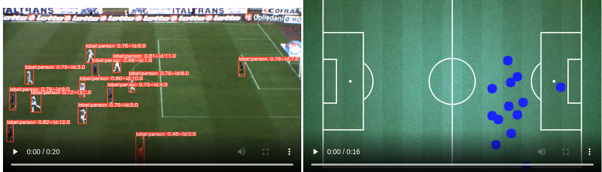

 

   

 

YOLOv5 is a family of object detection architectures and models pretrained on the COCO dataset, and represents <a href="https://ultralytics.com">Ultralytics</a>
 open-source research into future vision AI methods, incorporating lessons learned and best practices evolved over thousands of hours of research and development.

## This project is based on the Pytorch implementation of YOLOv5
